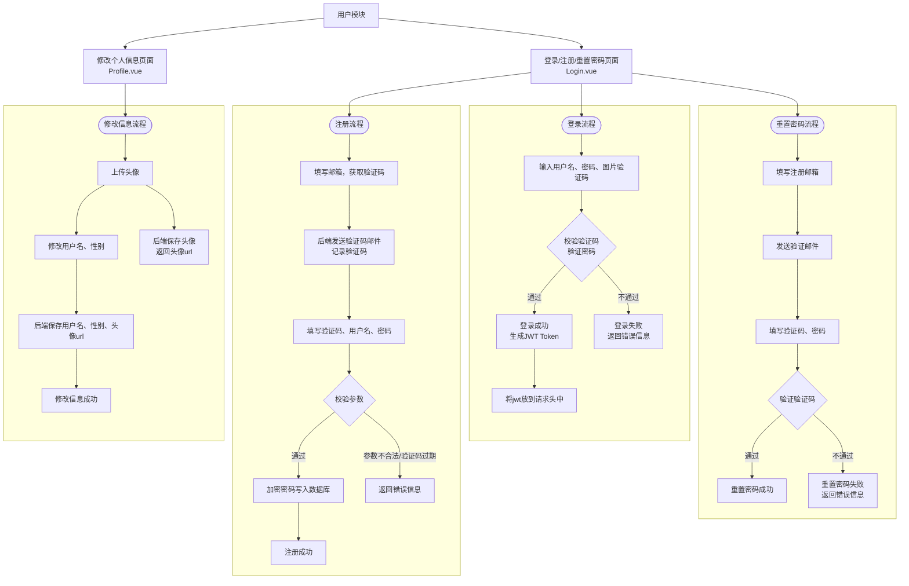
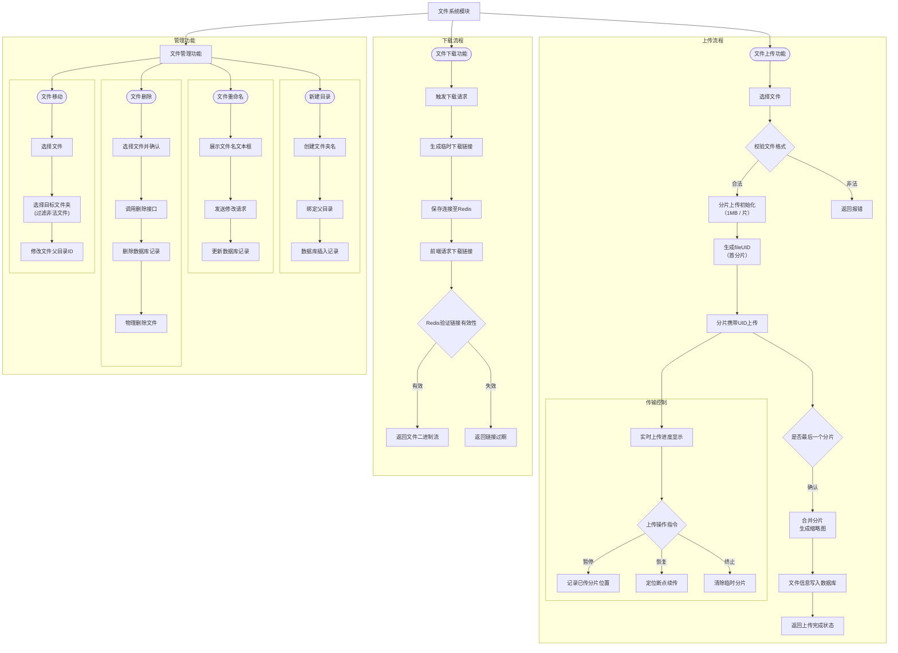

```mermaid
flowchart TD    
    A["用户模块"] --> F["修改个人信息页面<br>Profile.vue"]
    A --> B["登录/注册/重置密码页面<br>Login.vue"]

    B --> D(["注册流程"])
    B --> C(["登录流程"])
    B --> E(["重置密码流程"])
    F --> F0(["修改信息流程"])

    subgraph   
        F0 --> F1["上传头像"]
        F1 --> F2["修改用户名、性别"]
        F1 --> F3["后端保存头像<br>返回头像url"]
        F2 --> F4["后端保存用户名、性别、头像url"]
        F4 --> F5["修改信息成功"]
    end
    subgraph   
        D --> D1["填写邮箱，获取验证码"]
        D1 --> D2["后端发送验证码邮件<br>记录验证码"]
        D2 --> D3["填写验证码、用户名、密码"]
        D3 --> D4{"校验参数"}
        D4 -- 通过 --> D5["加密密码写入数据库"]
        D5 --> D6["注册成功"]
        D4 -- 参数不合法/验证码过期 --> D7["返回错误信息"]
    end

    subgraph   
        C --> C2["输入用户名、密码、图片验证码"]
        C2 --> C3{"校验验证码<br>验证密码"}
        C3 -- 通过 --> C4["登录成功<br>生成JWT Token"]
        C4 --> C5["将jwt放到请求头中"]
        C3 -- 不通过 --> C6["登录失败<br>返回错误信息"]
    end

    subgraph   
        E --> E1["填写注册邮箱"]
        E1 --> E2["发送验证邮件"]
        E2 --> E3["填写验证码、密码"]
        E3 --> E4{"验证验证码"}
        E4 -- 通过 --> E5["重置密码成功"]
        E4 -- 不通过 --> E6["重置密码失败<br>返回错误信息"]
    end

```

```mermaid
flowchart TD
    FileSystem["文件系统模块"] --> FileUpload(["文件上传功能"])
    FileSystem --> FileDownload(["文件下载功能"])
    FileSystem --> FileManagement["文件管理功能"]
    subgraph 上传流程
        FileUpload --> SelectFile["选择文件"]
        SelectFile --> CheckF{"校验文件格式"}
        CheckF -- 合法 --> InitUpload["分片上传初始化<br>（1MB / 片）"]
        CheckF -- 非法 --> Error1["返回报错"]
        InitUpload --> GenUID["生成fileUID<br>（首分片）"]
        GenUID --> Slices["分片携带UID上传"]
        Slices --> ProgressMonitor["实时上传进度显示"]
        subgraph 传输控制
            ProgressMonitor --> OpCon{"上传操作指令"}
            OpCon -- 暂停 --> PauseUpload["记录已传分片位置"]
            OpCon -- 恢复 --> ResumeUpload["定位断点续传"]
            OpCon -- 终止 --> Clean["清除临时分片"]
        end
        Slices --> FinalCheck{"是否最后一个分片"}
        FinalCheck -- 确认 --> MergeFiles["合并分片<br>生成缩略图"]
        MergeFiles --> DB["文件信息写入数据库"]
        DB --> OK1["返回上传完成状态"]
    end
    subgraph 下载流程
        FileDownload --> Download["触发下载请求"]
        Download --> CreationDownload["生成临时下载链接"]
        CreationDownload --> RedisCache["保存连接至Redis"]
        RedisCache --> LinkRequest["前端请求下载链接"]
        LinkRequest --> ValidityCheck{"Redis验证链接有效性"}
        ValidityCheck -- 有效 --> OK2["返回文件二进制流"]
        ValidityCheck -- 失效 --> Error2["返回链接过期"]
    end
    subgraph 管理功能
        FileManagement --> CreateFolder(["新建目录"])
        FileManagement --> RenameFile(["文件重命名"])
        FileManagement --> DeleteFile(["文件删除"])
        FileManagement --> MoveFile(["文件移动"])
        subgraph   
            CreateFolder --> InputName["创建文件夹名"]
            InputName --> SetParentDir["绑定父目录"]
            SetParentDir --> DBPersist["数据库插入记录"]
        end
        subgraph   
            RenameFile --> EditUI["展示文件名文本框"]
            EditUI --> UpdateRequest["发送修改请求"]
            UpdateRequest --> MetadataUpdate["更新数据库记录"]
        end
        subgraph   
            DeleteFile --> ConfirmAction["选择文件并确认"]
            ConfirmAction --> DeleteAPI["调用删除接口"]
            DeleteAPI --> LogicalDelete["删除数据库记录"]
            LogicalDelete --> PhysicalDelete["物理删除文件"]
        end
        subgraph   
            MoveFile --> SelectTarget["选择文件"]
            SelectTarget --> ValidatePath["选择目标文件夹<br>(过滤非法文件)"]
            ValidatePath --> UpdateParentID["修改文件父目录ID"]
        end
    end
```